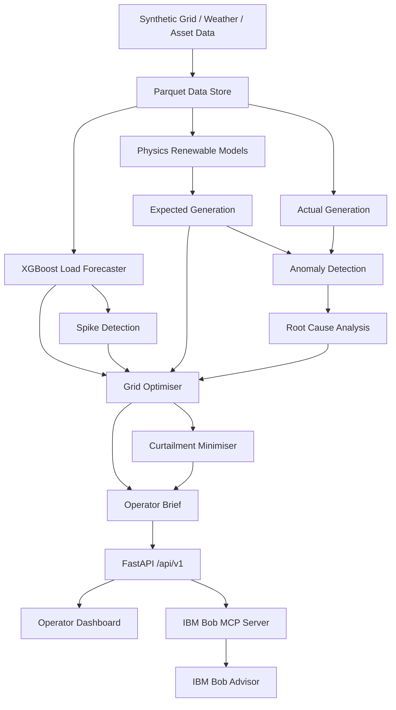

# ⚡ GridWise AI
## Grid Load Optimisation & Renewable Energy Performance Advisor

> **IBM Bob AI Innovation Hackathon 2026 · Team Outliers · Problem Statement U2**

> ⚠️ **Prototype Data Notice:** The current implementation uses SYNTHETIC / DEMO grid, weather, and renewable-asset data. Values shown by the prototype must not be interpreted as live utility, SCADA, or weather telemetry.

---

## 👥 Team Outliers

| Role | Member |
|---|---|
| Team Lead | **Smit Bhalani** |
| Member | **Chaitya Vakani** |
| Member | **Aryan Patel** |
| Member | **Vedant Bhatt** |

**Problem Statement:** U2 — Grid Load Optimisation & Renewable Energy Performance Advisor

---

# 🎯 Problem Statement

The US curtailed **~8 TWh of clean energy in 2023** — renewable electricity was switched off because the grid could not absorb it.

At the same time, unexpected demand spikes can cause grid instability.

Grid operators therefore need to simultaneously:

- forecast upcoming electricity-demand spikes,
- balance variable renewable generation,
- detect underperforming solar and wind assets,
- identify why those assets are underperforming,
- determine appropriate grid-balancing actions, and
- minimise unnecessary renewable curtailment.

Today, these decisions are often supported by separate tools rather than one integrated operator intelligence workflow.

### U2 Challenge

> Build a Bob solution that forecasts demand spikes, recommends load-balancing actions, detects anomalies in renewable energy performance, identifies root causes per underperforming asset, and generates an integrated operator optimisation brief with a curtailment minimisation plan.

---

# 💡 Our Solution — GridWise AI

**GridWise AI** is an AI-powered grid intelligence and operator decision-support platform designed specifically around the U2 challenge.

It combines:

**Load Forecasting → Demand Spike Detection → Renewable Performance Modelling → Anomaly Detection → Root Cause Analysis → Grid Optimisation → Curtailment Minimisation → IBM Bob Operator Advisor**

into one integrated workflow.

Instead of giving the operator only a prediction, GridWise AI answers three operational questions:

### 1. What is going to happen?
XGBoost forecasts electricity demand over the next 24 hours and identifies potential demand-spike periods.

### 2. What is going wrong?
Physics-based renewable models estimate expected solar/wind generation. Actual and expected output are compared to detect underperforming assets and identify probable root causes.

### 3. What should the operator do?
The optimisation engine recommends BESS dispatch, demand response, backup generation, flexible-load absorption, export, and finally unavoidable curtailment.

IBM Bob then combines these computed results into an operator-ready optimisation brief.

---

# 🔥 Challenge → Solution Mapping

| U2 Requirement | GridWise AI Implementation |
|---|---|
| Forecast demand spikes | XGBoost 24-hour load forecasting |
| Detect dangerous periods | Reserve-margin spike detection |
| Balance grid load | BESS + demand response + backup optimisation |
| Detect renewable anomalies | Expected-vs-actual performance analysis |
| Identify root cause | Evidence-based solar/wind RCA |
| Reduce renewable curtailment | BESS → flexible load → export → curtailment |
| Generate optimisation brief | Integrated `/api/v1/advisor/brief` |
| Use IBM Bob | Custom MCP server exposing 9 backend tools |

---

# 🧠 End-to-End Intelligence Pipeline

```text
Synthetic Grid + Weather + Renewable Asset Data
                       │
                       ▼
              XGBoost Load Forecast
                       │
                       ▼
             Demand Spike Detection
                       │
                       ▼
        Solar / Wind Expected Generation
                       │
                       ▼
            Expected vs Actual Output
                       │
                       ▼
                Anomaly Detection
                       │
                       ▼
          Evidence-Based Root Cause
                       │
                       ▼
             Grid Optimisation Engine
                       │
             ┌─────────┴─────────┐
             ▼                   ▼
      Load Balancing       Curtailment Plan
             │                   │
             └─────────┬─────────┘
                       ▼
                FastAPI /api/v1
                       │
             ┌─────────┴──────────┐
             ▼                    ▼
      Operator Dashboard      IBM Bob MCP
                                  │
                                  ▼
                       Operator Optimisation Brief
```

---

# 🚀 Core Features

## 1. 24-Hour Load Forecasting

GridWise AI uses **XGBoost** to forecast grid electricity demand.

Current prototype:

- 8,760 hourly synthetic observations
- chronological `70 / 15 / 15` train-validation-test split
- lag features
- rolling statistics
- temperature and humidity
- time-of-day features
- day-of-week features
- leakage-safe model construction

### Current Model Results

| Metric | Test Result |
|---|---:|
| R² | **≈ 0.90** |
| MAE | **≈ 49 MW** |
| RMSE | **≈ 68 MW** |

The forecast provides the input to the demand-spike detector.

---

# 🚨 Demand Spike Detection

Forecast demand is compared against available grid capacity.

The system calculates reserve margin and assigns:

```text
LOW
MEDIUM
HIGH
CRITICAL
```

This converts the ML forecast into an operational risk signal.

Example:

```text
Forecast Demand      = 2,420 MW
Available Capacity   = 2,600 MW

Reserve              = 180 MW
Reserve Margin       = 6.9%

Risk                 = HIGH
```

---

# ☀️ Solar Performance Intelligence

Expected solar generation is estimated using physical conditions such as:

- solar irradiance
- cloud cover
- temperature
- time
- plant capacity

Conceptually:

```text
Expected Solar Power
≈ Irradiance
× Cloud Transmissivity
× Temperature Derating
× Plant Capacity
```

This provides an explainable expected-output baseline.

---

# 🌬️ Wind Performance Intelligence

Expected wind generation considers:

- wind speed
- wind direction
- temperature
- turbine cut-in speed
- rated speed
- cut-out speed
- installed capacity

The model follows the physical relationship:

```text
Wind Power ∝ Wind Speed³
```

while respecting turbine operating limits.

---

# 🔎 Renewable Anomaly Detection

GridWise AI compares:

```text
Expected Generation
        vs
Actual Generation
```

and calculates:

```text
Performance Ratio
Absolute MW Deviation
Percentage Deviation
Severity
```

Assets are classified as:

```text
NORMAL
WARNING
CRITICAL
```

Nighttime solar and other low-expected-generation conditions are suppressed to reduce false alarms.

---

# 🧩 Evidence-Based Root Cause Analysis

Detecting an anomaly is only the first step.

GridWise AI attempts to determine **why** an asset is underperforming.

The RCA engine separates:

```text
Total Generation Loss
        │
        ├── Weather-Explained Loss
        │
        └── Unexplained Asset-Side Loss
```

### Solar evidence

The system considers:

- high cloud cover
- low irradiance
- high-temperature derating
- unexplained clear-sky generation loss
- possible sensor/telemetry issue

### Wind evidence

The system considers:

- insufficient wind
- turbine cut-in conditions
- rated operating region
- excessive wind / cut-out conditions
- unexplained generation loss
- possible telemetry issue

GridWise AI does **not** declare a mechanical failure without evidence.

Instead it can return:

```text
Probable Cause:
Unexplained asset-side underperformance

Confidence:
High

Recommended Action:
Inspect inverter/string availability and verify telemetry.
```

---

# ⚙️ Grid Optimisation Engine

When GridWise AI detects a power deficit, the optimiser prioritises:

```text
1. BESS Discharge
       ↓
2. Demand Response / Load Shifting
       ↓
3. Backup Generation
```

For renewable surplus:

```text
1. Charge BESS
       ↓
2. Flexible Load
       ↓
3. Export
       ↓
4. Curtailment — LAST RESORT
```

Battery constraints include:

- State of Charge
- maximum charge power
- maximum discharge power
- efficiency
- interval-to-interval SOC continuity

---

# ♻️ Curtailment Minimisation

GridWise AI explicitly calculates:

```text
Potential Curtailment
        │
        ├── BESS Absorption
        ├── Flexible Load
        ├── Export
        │
        ▼
Unavoidable Curtailment
```

The system reports:

- potential curtailment
- BESS absorption
- flexible-load absorption
- export
- unavoidable curtailment
- avoided curtailment
- curtailment reduction %

This directly addresses the renewable-curtailment requirement in U2.

---

# 🤖 IBM Bob Integration

IBM Bob is a core component of GridWise AI.

A custom **MCP — Model Context Protocol** server exposes GridWise AI analytics to Bob.

Bob does not generate operational numbers itself.

Instead:

```text
Operator Question
       ↓
    IBM Bob
       ↓
   MCP Tool
       ↓
GridWise FastAPI
       ↓
Forecast / RCA / Optimisation
       ↓
Computed JSON
       ↓
    IBM Bob
       ↓
Operator Explanation
```

## 9 IBM Bob Tools

| Bob Tool | GridWise API | Purpose |
|---|---|---|
| `get_grid_status` | `/api/v1/grid/status` | Current grid status |
| `get_load_forecast` | `/api/v1/forecast/load` | 24h demand forecast |
| `get_spike_risks` | `/api/v1/grid/risks` | Demand-spike periods |
| `get_renewable_forecast` | `/api/v1/forecast/renewables` | Expected renewable output |
| `get_asset_anomalies` | `/api/v1/assets/anomalies` | Underperforming assets |
| `diagnose_asset` | `/api/v1/assets/{id}/diagnosis` | Root-cause analysis |
| `get_optimisation_plan` | `/api/v1/optimisation/plan` | Grid balancing plan |
| `get_curtailment_plan` | `/api/v1/curtailment/plan` | Curtailment plan |
| `generate_operator_brief` | `/api/v1/advisor/brief` | Integrated operator brief |

### Example Bob Queries

```text
"What are the grid risks over the next 6 hours?"

"Which renewable assets are underperforming and why?"

"Diagnose SOL-02."

"What load-balancing actions should we take?"

"How much renewable curtailment can we avoid?"

"Generate the integrated optimisation brief for Scenario B."
```

Bob consumes calculated results instead of fabricating telemetry.

---

# 📋 Integrated Operator Brief

The main operator intelligence endpoint is:

```http
GET /api/v1/advisor/brief
```

It combines:

```text
Grid Status
+
Demand Forecast
+
Spike Risks
+
Renewable Status
+
Asset Anomalies
+
Root Causes
+
Optimisation Plan
+
Curtailment Plan
+
Recommended Actions
+
Known Uncertainties
```

into one structured briefing.

Supported scenarios:

```text
/api/v1/advisor/brief?scenario=live
/api/v1/advisor/brief?scenario=A
/api/v1/advisor/brief?scenario=B
/api/v1/advisor/brief?scenario=C
```

---

# 🖥️ Operator Dashboard

GridWise AI provides an operator-oriented dashboard containing:

| Module | Purpose |
|---|---|
| Overview | Overall grid health and KPIs |
| Load Forecast | 24h demand forecast |
| Grid Risk | Spike-risk periods |
| Renewable Performance | Solar/wind performance |
| Asset Diagnosis | RCA and recommended inspections |
| Grid Optimisation | BESS / DR / backup actions |
| Curtailment | Renewable absorption and curtailment |
| AI Advisor | IBM Bob + integrated operator brief |

The AI Advisor automatically generates the **Live Brief** when the page loads.

---

# 🧪 Reproducible Demo Scenarios

## Live

Latest available synthetic/demo state.

## Scenario A — Normal Operation

```text
Moderate Demand
Healthy Renewable Assets
Adequate Reserve
```

## Scenario B — Demand Spike

```text
Evening Demand Surge
Reduced Renewable Contribution
Limited Reserve
BESS Dispatch Required
```

## Scenario C — Renewable Surplus + Asset Anomaly

```text
High Renewable Availability
Solar Asset Underperformance
BESS Near High SOC
Curtailment Risk
```

## Scenario D — Combined Hackathon Demo

Demonstrates both:

```text
Demand Spike
+
Renewable Asset Underperformance
+
Root Cause Analysis
+
Grid Optimisation
+
IBM Bob Brief
```

---

# 🏗️ Architecture



Full architecture documentation:

```text
docs/architecture.md
```

---

# 🛠️ Tech Stack

| Category | Technologies |
|---|---|
| Languages | Python, TypeScript, JavaScript, HTML, CSS |
| Machine Learning | XGBoost, scikit-learn |
| Data | pandas, NumPy, Apache Parquet |
| Backend | FastAPI, Pydantic, Uvicorn |
| IBM | IBM Bob |
| AI Integration | MCP — Model Context Protocol |
| MCP Runtime | Node.js, TypeScript, Zod |
| Testing | pytest |

---

# 📡 REST API

GridWise AI exposes a versioned API:

```text
/api/v1
```

### Main Endpoints

```text
GET /api/v1/health

GET /api/v1/grid/status

GET /api/v1/forecast/load

GET /api/v1/forecast/renewables

GET /api/v1/grid/risks

GET /api/v1/assets/anomalies

GET /api/v1/assets/{asset_id}/diagnosis

GET /api/v1/optimisation/plan

GET /api/v1/curtailment/plan

GET /api/v1/advisor/brief
```

FastAPI automatically exposes:

```text
/docs
/openapi.json
/redoc
```

---

# 📁 Repository Structure

```text
bob-ai-hackathon-outliers/
│
├── submission.yaml
├── README.md
│
├── src/
│   ├── backend/
│   ├── ml/
│   ├── data/
│   ├── models/
│   ├── services/
│   ├── bob_mcp/
│   ├── tests/
│   ├── utils/
│   ├── requirements.txt
│   └── .env.example
│
├── docs/
│   ├── problem-statement.md
│   ├── solution-overview.md
│   ├── architecture.md
│   └── setup-guide.md
│
├── demo/
│   ├── demo-video-link.txt
│   ├── live-demo-url.txt
│   └── screenshots/
│
├── presentation/
│
└── .bob/
    └── mcp.json
```

---

# ▶️ How to Run

Full instructions are available in:

```text
docs/setup-guide.md
```

### 1. Install dependencies

```bash
python -m pip install -r src/requirements.txt
```

### 2. Generate demo data

```bash
python -m src.data.synthetic_generator
```

### 3. Run tests

```bash
python -m pytest src/tests/ -v
```

### 4. Start GridWise AI

```bash
python -m uvicorn src.backend.main:app --host 0.0.0.0 --port 8000 --reload
```

Open:

```text
Landing Page
http://localhost:8000/

Operator Dashboard
http://localhost:8000/dashboard

Swagger API
http://localhost:8000/docs

Hackathon Demo
http://localhost:8000/demo
```

---

# ✅ Testing

The project includes tests for:

- load forecasting
- leakage prevention
- spike detection
- solar/wind generation
- anomaly detection
- RCA
- BESS constraints
- grid optimisation
- curtailment
- demo scenarios
- REST API behaviour

Run:

```bash
python -m pytest src/tests/ -v
```

Current project documentation reports:

```text
139 tests passing
0 failures
```

---

# ⚠️ Known Limitations

1. The current prototype uses **synthetic/demo data** rather than live grid or SCADA telemetry.
2. XGBoost performance is evaluated on the synthetic dataset and is not claimed to represent production utility performance.
3. Production real-time ingestion is not implemented.
4. Economic dispatch and electricity-market pricing are not currently modelled.
5. BESS dispatch uses a priority/forward strategy rather than full multi-day mathematical optimisation.
6. Renewable models simplify effects such as equipment ageing, solar-panel soiling and complex wind-farm wake effects.
7. Production authentication and multi-user security are outside the current hackathon prototype.

---

# 🏆 What We're Most Proud Of

The strongest aspect of GridWise AI is the **end-to-end evidence chain**.

When a renewable asset underperforms, GridWise AI does not immediately declare a fault.

It follows:

```text
Expected Generation
        ↓
Performance Deviation
        ↓
Weather Explanation
        ↓
Unexplained Loss
        ↓
Probable Root Cause
        ↓
Recommended Action
        ↓
Grid Optimisation
        ↓
Curtailment Plan
        ↓
IBM Bob Operator Brief
```

This makes every important recommendation traceable back to calculated evidence.

IBM Bob acts as the conversational intelligence layer over this evidence instead of inventing operational measurements.

---

# 📦 Submission Artifacts

| Artifact | Location |
|---|---|
| Source Code | [`src/`](src/) |
| Problem Statement | [`docs/problem-statement.md`](docs/problem-statement.md) |
| Solution Overview | [`docs/solution-overview.md`](docs/solution-overview.md) |
| Architecture | [`docs/architecture.md`](docs/architecture.md) |
| Setup Guide | [`docs/setup-guide.md`](docs/setup-guide.md) |
| Demo Video | [`demo/demo-video-link.txt`](demo/demo-video-link.txt) |
| Live Demo | [`demo/live-demo-url.txt`](demo/live-demo-url.txt) |
| Screenshots | [`demo/screenshots/`](demo/screenshots/) |
| Presentation | [`presentation/`](presentation/) |
| Submission Metadata | [`submission.yaml`](submission.yaml) |

---

<div align="center">

## ⚡ GridWise AI

### Forecast → Detect → Diagnose → Optimise → Minimise Curtailment → Explain with IBM Bob

**Team Outliers**

**U2 — Grid Load Optimisation & Renewable Energy Performance Advisor**

</div>