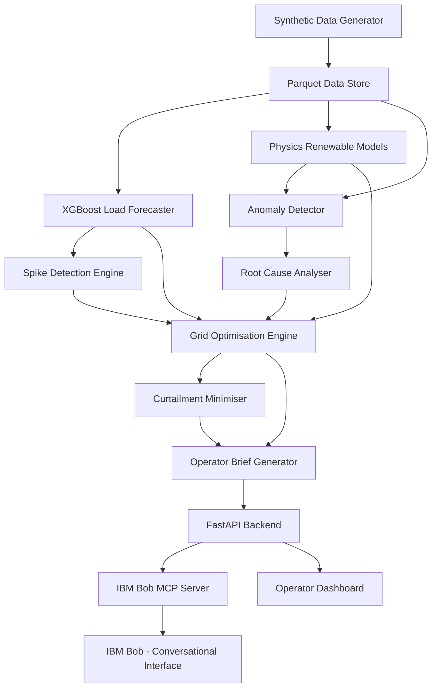

# GridWise AI — Grid Load Optimisation & Renewable Energy Performance Advisor

> **WARNING: All data in this project is SYNTHETIC / DEMO data — not real grid or weather telemetry.**

---

## Team

| Field | Value |
|---|---|
| **Team Name** | Outliers |
| **Track** | AI |
| **Team Lead** | Aryan Vyas — aryan.vyas@ibm.com |
| **Members** | Aryan Vyas |

---

## Problem Statement

Grid operators face a multi-dimensional real-time challenge: they must simultaneously forecast electricity demand spikes, understand renewable generation availability, detect underperforming solar and wind assets, identify root causes of underperformance, and minimise renewable curtailment — all under operational pressure and within response windows measured in minutes.

No existing single tool integrates all these tasks with conversational AI assistance in one operator interface, forcing operators to switch between disconnected systems while the grid state changes.

---

## Solution

GridWise AI is a full-stack analytics and optimisation platform that chains:
- **XGBoost demand forecasting** → **physics-based renewable models** → **deterministic anomaly detection** → **evidence-based root cause analysis** → **priority-order BESS/demand-response optimisation** → **IBM Bob conversational interface**

IBM Bob is integrated via a custom MCP server exposing nine backend analytics tools. Operators can ask natural-language questions and receive structured, computed answers — Bob retrieves real calculated results and never fabricates telemetry or measurements.

---

## Key Features

- **XGBoost Load Forecasting**: 24-hour demand forecast trained on 8,760 hours of synthetic data. Chronological 70/15/15 split. Leakage-free lag features. Test R² = 0.90, MAE = 49 MW.
- **Physics-Based Renewable Models**: Explainable solar (GHI × cloud transmissivity × temperature derating) and wind (cubic power curve + air density correction) generation models. Every intermediate step is returned for transparency.
- **Evidence-Based Root Cause Analysis**: Separates weather-explained losses from unexplained losses. Correctly classifies heavy cloud cover as weather (not a fault). Returns confidence-scored causes. Never claims mechanical failure without evidence.
- **Grid Optimisation Engine**: Priority-order dispatch: BESS discharge → demand response → backup generation for deficits; BESS charging → flexible load → export → curtailment for surplus. All BESS SOC and power constraints enforced.
- **IBM Bob MCP Integration**: 9 MCP tools calling the FastAPI backend. Bob reads computed results — spike risks, anomalies, diagnoses, optimisation plans, operator briefs — and presents them with data-type labels (MEASURED / ML PREDICTION / RULE-BASED / AI EXPLANATION).
- **Operator Dashboard**: 7-page dark-mode grid-operations dashboard. Overview, load forecast, grid risk, asset performance, asset diagnosis, grid optimisation, curtailment, and AI advisor pages.
- **Reproducible Demo Scenarios**: A (normal), B (demand spike), C (renewable surplus + fault), D (combined spike + inverter fault for hackathon demo).

---

## Architecture



See [`docs/architecture.md`](docs/architecture.md) for the full Mermaid diagram and data-flow explanation.

---

## Tech Stack

| Category | Technologies |
|---|---|
| **Languages** | Python 3.11+, TypeScript, HTML/CSS/JavaScript |
| **ML / Analytics** | XGBoost, scikit-learn, pandas, numpy |
| **Backend** | FastAPI, uvicorn, Pydantic |
| **IBM Technologies** | IBM Bob, MCP (Model Context Protocol) |
| **Data Storage** | Apache Parquet (via pyarrow) |
| **MCP Server** | Node.js 20+, @modelcontextprotocol/sdk, Zod |
| **Testing** | pytest (62 tests) |

---

## Repository Structure

```
├── src/
│   ├── backend/          # FastAPI application + Phase 2 routes + dashboard HTML
│   ├── ml/               # All ML and analytics modules
│   │   ├── load_forecasting.py
│   │   ├── spike_detection.py
│   │   ├── renewable_generation.py
│   │   ├── anomaly_detection.py
│   │   ├── root_cause_analysis.py
│   │   ├── grid_optimiser.py
│   │   ├── curtailment.py
│   │   └── operator_brief.py
│   ├── data/             # Synthetic data generator + demo scenarios
│   ├── models/           # Pydantic schemas
│   ├── services/         # Data store + model caching
│   ├── bob_mcp/          # IBM Bob MCP server (Node.js/TypeScript)
│   ├── tests/            # 62 pytest tests (Phase 1 + 2)
│   ├── utils/            # Audit and validation scripts
│   ├── requirements.txt
│   └── .env.example
├── docs/                 # Written documentation
├── demo/                 # Screenshots, video link, live URL
├── presentation/         # Slide deck
├── .bob/mcp.json         # Bob MCP server registration
└── submission.yaml       # Structured submission metadata
```

---

## How to Run

See [`docs/setup-guide.md`](docs/setup-guide.md) for full instructions.

```bash
# 1. Install Python dependencies
pip install -r src/requirements.txt

# 2. Generate synthetic data (~5 seconds)
python -m src.data.synthetic_generator

# 3. Run all 62 tests
pytest src/tests/ -v

# 4. Start the API + Dashboard
uvicorn src.backend.main:app --host 0.0.0.0 --port 8000 --reload

# Dashboard:  http://localhost:8000/dashboard
# API Docs:   http://localhost:8000/docs
# Demo:       http://localhost:8000/demo
```

---

## IBM Bob Integration

GridWise AI integrates with IBM Bob via a custom MCP server ([`src/bob_mcp/`](src/bob_mcp/)) registered at [`.bob/mcp.json`](.bob/mcp.json).

**9 MCP tools available to Bob:**

| Tool | What Bob Gets |
|---|---|
| `get_grid_status` | Current load, capacity, reserve margin, risk level |
| `get_load_forecast` | 24h XGBoost forecast with model metrics |
| `get_spike_risks` | Per-hour risk classification (LOW/MEDIUM/HIGH/CRITICAL) |
| `get_renewable_forecast` | Expected generation per asset |
| `get_asset_anomalies` | Anomalous assets with performance ratios |
| `diagnose_asset` | RCA with weather-explained vs unexplained loss |
| `get_optimisation_plan` | BESS/DR/backup dispatch plan |
| `get_curtailment_plan` | Curtailment minimisation analysis |
| `generate_operator_brief` | Full 14-section operator brief |

**Example Bob queries:**
- *"What are the grid risks over the next 6 hours?"*
- *"Which renewable assets are underperforming and why?"*
- *"How much renewable curtailment can we avoid?"*
- *"Generate the operator optimisation brief for scenario B."*

Bob always labels data as: `[MEASURED DATA]`, `[ML MODEL PREDICTION]`, `[RULE-BASED RESULT]`, or `[HEURISTIC RCA]` — never invents measurements.

---

## Demo

| Artifact | Link |
|---|---|
| Demo Video | [See demo/demo-video-link.txt](demo/demo-video-link.txt) |
| Live Demo | [See demo/live-demo-url.txt](demo/live-demo-url.txt) |
| Screenshots | [See demo/screenshots/](demo/screenshots/) |
| Presentation | [See presentation/](presentation/) |

### Hackathon Demo Scenario (Scenario D)

The demo scenario combines:
1. **Approaching evening demand spike** — load rising to 2,115 MW with reserve margin < 12%
2. **SOL-02 inverter fault** — 18% capacity factor on a clear sky day (950 W/m² irradiance)

Run it: `GET http://localhost:8000/demo`

---

## Known Limitations

1. **Synthetic data only** — not real grid or weather telemetry
2. **No real-time ingestion** — data is static parquet files from a one-time generator
3. **No economic dispatch** — market prices and curtailment costs not modelled
4. **Greedy BESS optimisation** — forward-greedy per-interval, not multi-day rolling optimal
5. **Bob dashboard routing** — keyword-based in the browser; full tool-call chain needs MCP server + running API
6. **No authentication** — API endpoints are unauthenticated
7. **No CI/CD** — no automated deployment pipeline

---

## What We're Most Proud Of

The **evidence chain integrity**: from the moment a solar asset underperforms, the system traces the physics (is irradiance low? is it cloudy?), separates weather-explainable loss from genuine unexplained loss, assigns calibrated confidence scores to root causes, and surfaces a concrete inspection recommendation — all without fabricating any number. IBM Bob then retrieves these computed results and explains them in plain language, correctly labelling each piece of data by its source type. This is the exact kind of transparent, auditable AI that grid operators need to trust.

---

## Strongest Technical Contribution

The **Root Cause Analysis engine** ([`src/ml/root_cause_analysis.py`](src/ml/root_cause_analysis.py)) combined with the **Grid Optimisation Engine** ([`src/ml/grid_optimiser.py`](src/ml/grid_optimiser.py)). Together they demonstrate that deterministic, explainable, constraint-respecting AI can be more operationally valuable than black-box models — every decision has a traceable arithmetic path from input data to recommended action.
