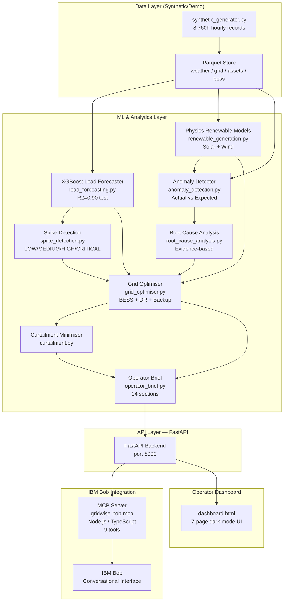

# Architecture

## System Architecture Diagram



## Component Details

### Data Layer

| Component | File | Description |
|---|---|---|
| Synthetic Generator | `src/data/synthetic_generator.py` | Generates 8,760 hours of realistic weather, grid load, 5 renewable assets, 2 BESS units. Seeded RNG. Fault injection in ~5% of records. |
| Demo Scenarios | `src/data/scenarios.py` | 3 pre-defined scenarios (A/B/C) + `demo_scenario.py` (D) |
| Parquet Store | `src/data/synthetic/` | Weather, grid, assets, bess parquet files |
| Data Store | `src/services/data_store.py` | Loader + model cache singleton |

### ML & Analytics Layer

| Component | File | Algorithm | Output |
|---|---|---|---|
| Load Forecasting | `src/ml/load_forecasting.py` | XGBoost + 14 features | 24h forecast, MAE/RMSE/R² |
| Renewable Models | `src/ml/renewable_generation.py` | Physics equations | Expected MW + capacity factor + explanation dict |
| Spike Detection | `src/ml/spike_detection.py` | Reserve margin thresholds | Risk level + score per interval |
| Anomaly Detection | `src/ml/anomaly_detection.py` | Performance ratio thresholds | NORMAL/WARNING/CRITICAL per asset |
| Root Cause Analysis | `src/ml/root_cause_analysis.py` | Evidence-weighted rules | Weather loss + unexplained loss + cause candidates |
| Grid Optimiser | `src/ml/grid_optimiser.py` | Priority-order dispatch | Per-interval BESS/DR/backup actions |
| Curtailment | `src/ml/curtailment.py` | Arithmetic derivation | Absorption breakdown + reduction % |
| Operator Brief | `src/ml/operator_brief.py` | Template assembly | 14-section text + structured dict |

### API Layer

Base framework: **FastAPI** on **uvicorn**.

| Route | Source | Tags |
|---|---|---|
| `GET /health` | `main.py` | System |
| `GET /assets` | `main.py` | Assets |
| `GET /assets/anomalies` | `main.py` | Assets |
| `GET /assets/{id}/diagnosis` | `main.py` | Assets |
| `GET /forecast/load` | `main.py` | Forecasting |
| `GET /forecast/renewables` | `main.py` | Forecasting |
| `GET /grid/risk` | `main.py` | Grid |
| `GET /optimisation/plan` | `routes_phase2.py` | Optimisation |
| `GET /optimisation/curtailment` | `routes_phase2.py` | Optimisation |
| `GET /brief` | `routes_phase2.py` | Operator |
| `GET /scenarios` | `routes_phase2.py` | Optimisation |
| `GET /demo` | `routes_phase2.py` | Optimisation |
| `GET /dashboard` | `main.py` | System |

### IBM Bob MCP Server

**Location**: `src/bob_mcp/`  
**Runtime**: Node.js 20+, TypeScript  
**Transport**: stdio (Bob spawns as child process)  
**Config**: `.bob/mcp.json`

| MCP Tool | Backend Endpoint | Data Type |
|---|---|---|
| `get_grid_status` | `/grid/risk?horizon_hours=1` | Rule-based |
| `get_load_forecast` | `/forecast/load` | ML Prediction |
| `get_spike_risks` | `/grid/risk` | Rule-based |
| `get_renewable_forecast` | `/forecast/renewables` | Physics model |
| `get_asset_anomalies` | `/assets/anomalies` | Rule-based |
| `diagnose_asset` | `/assets/{id}/diagnosis` | Heuristic RCA |
| `get_optimisation_plan` | `/optimisation/plan` | Deterministic dispatch |
| `get_curtailment_plan` | `/optimisation/curtailment` | Derived from dispatch |
| `generate_operator_brief` | `/brief` | Aggregated |

### Operator Dashboard

Single-page application served at `/dashboard`. Pure HTML/CSS/JS — no frontend framework.

| Page | Data Sources |
|---|---|
| Overview | `/grid/risk`, `/assets/anomalies`, `/optimisation/curtailment`, `/forecast/renewables` |
| Load Forecast | `/forecast/load`, `/grid/risk` |
| Grid Risk | `/grid/risk` |
| Asset Performance | `/assets`, `/assets/anomalies` |
| Asset Diagnosis | `/assets/{id}/diagnosis` |
| Grid Optimisation | `/optimisation/plan` |
| Curtailment | `/optimisation/curtailment` |
| AI Operator Advisor | Bob tool routing via `/grid/risk`, `/assets/anomalies`, `/brief`, `/optimisation/plan`, etc. |

## Data Flow — End-to-End

```
1. synthetic_generator.py
   └─ Generates: weather.parquet, grid.parquet, assets.parquet, bess.parquet

2. data_store.py loads parquets on demand, caches XGBoost model

3. /forecast/load request:
   └─ load_forecasting.build_features(grid, weather)
   └─ model.predict(X_future) → 24 × {timestamp, forecast_load_mw}

4. /grid/risk request:
   └─ forecast → detect_spikes(forecast, capacity) → reserve_margin → risk_level

5. /forecast/renewables request:
   └─ solar_expected(irradiance, cloud_cover, temp, capacity) per asset per hour
   └─ wind_expected(wind_speed, direction, temp, capacity) per asset per hour

6. /assets/anomalies request:
   └─ detect_anomalies(assets_window) → compare actual vs expected → severity

7. /assets/{id}/diagnosis request:
   └─ diagnose_asset(asset_row, weather) → weather_loss + unexplained_loss + causes

8. /optimisation/plan request:
   └─ build forecast_df → run_optimisation(forecast_df, bess_df)
   └─ per-interval: BESS/DR/backup dispatch with SOC constraints

9. /optimisation/curtailment:
   └─ compute_curtailment_analysis(opt_df) → absorption breakdown

10. /brief:
    └─ generate_operator_brief(all above inputs) → 14-section structured text

11. Bob MCP tool call:
    └─ node src/bob_mcp/build/index.js
    └─ tool(params) → apiGet(backend_path) → formatted text
    └─ Bob receives text with [DATA TYPE] labels
```

## Security and Data Integrity Notes

- All data is **synthetic and clearly labelled** — no real grid telemetry
- No secrets are stored in code; all configuration via `.env` (gitignored)
- `.env.example` documents all variables without values
- API has no authentication (Phase 3 limitation — suitable for hackathon demo)
- Parquet files in `src/data/synthetic/` are generated at runtime and not committed
